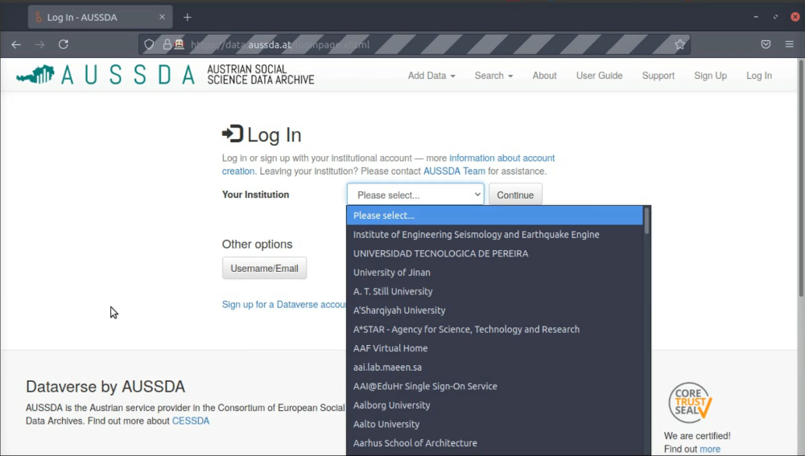
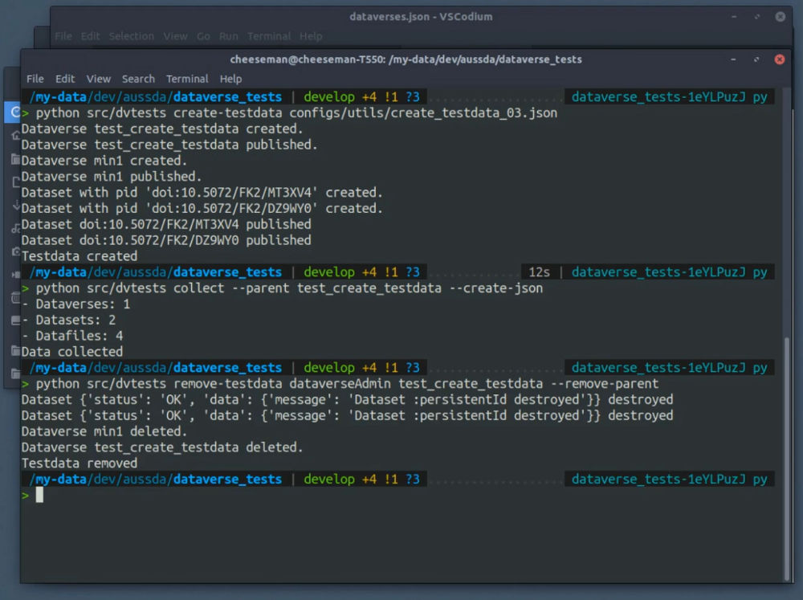

# Dataverse Tests

  [](https://doi.org/10.5281/zenodo.6802981) [](https://opensource.org/licenses/MIT) [](https://github.com/psf/black)

Dataverse tests helps you to test the operational requirements of your [Dataverse](dataverse.org/) installation to maintane stability and low risk. It offers tests for integration, system and risk-based testing. In addition to the tests, `utils` offers a CLI of common workflow actions to help you with your testing activities.

Tests are written in Python with pytest, requests and Selenium. They are easy to adapt and extend. They are Open Source and well documented. The tests do not contain common frontend or backend unit tests, which are part of Dataverse development itself.

Funded by:

<a href="https://www.sshopencloud.eu/"></a><a href="https://www.aussda.at/"></a>

**Features**

General

* Tested with Dataverse 4.18.1, 5.2, 5.6 and 5.7
* Settings management
* Flexible and easy to use for your own Dataverse instance
* Integration of [dataverse_testdata](https://github.com/gdcc/dataverse_testdata/) and [dataverse-sample-data](https://github.com/IQSS/dataverse-sample-data/)
* Open Source (MIT)

Tests (`testing/`)

* Modular test architecture, optimized for use on Jenkins or similar build/testing tools
* Supports Firefox and Chrome
* Tests: Login (normal + Shibboleth), Data Completeness, Create Dataverse Frontend, Installation / Server, Search, OAI-PMH, Sitemap, robots.txt, Terms of Use

Helper functions (`utils/`)

* CLI integration
* Collect (all) data of your installation: Dataverses, Datasets, Datafiles
* Upload defined set of testdata
* Remove (all) testdata
* Create users

**Use-Cases**

* Installation: Test a fresh, customized Dataverse installation
* Upgrade: Test configuration and data completeness after upgrade
* Monitoring: Frequent testing during operation

**Demos**

Login testing:

<a href="http://pydataverse.stefankasberger.at/dataverse_tests/tests_login.mp4"></a>

Using utils for your data workflow:

<a href="http://pydataverse.stefankasberger.at/dataverse_tests/utils_workflow.mp4"></a>

## Install

**Pre-requisites**

Python >= 3.6

Python packages:

* [pydantic](https://pydantic-docs.helpmanual.io/)
* [pyDataverse](https://github.com/gdcc/pyDataverse)
* [pytest-selenium](https://pytest-selenium.readthedocs.io/)
* [typer](https://typer.tiangolo.com/)

Browser engine(s) (optional for Selenium-based tests):

* Geckodriver (Firefox)
* Chromedriver

**Clone repository + init submodules**

```shell
git clone --recurse-submodules https://github.com/gdcc/dataverse_tests.git
cd dataverse_tests/
```

**Install requirements**

```bash
pipenv install
```

**Activate virtual environment**


```shell
pipenv shell
```

**Install dataverse_tests**

```bash
pip install .
```
## Basic Usage

### 1. Set up .env-file

Before you can start with ether `testing` or `utils`, you have to configure the settings management. You need to create an `.env`-file for each Dataverse installation, and set the needed variables in it. Start by using the `env-config/example.env` template. The `.env` file filename is your central identifier for works done with your Dataverse installation and then later on used for other naming purposes, so use a descriptive one (e. g. `ORGANISATION_INSTALLATION.env` =>  `aussda_production.env`). Once setup, you have to set the `ENV_FILE` environment variable in your terminal to your absolute path of your `.env`-file.

```shell
export ENV_FILE="/ABSOLUTE/FILE/PATH/TO/ENV/FILE.env"
```

Note: To not track testing activities with you web-analytics service (e. g. Matomo or Google Analytics), you should set the user agent and exclude calls from it in you web-analytics service.

Note: Environment variables set via command line will overwrite the ones defined in an `.env`-file.

Find the used environment variables documented in `src/dvtests/settings.py`.

## 2. Create user JSON

For some tests and utils functions, you need at least one user who has proper rights to do API requests, create Datasets, to login or do other stuff. These user credentials are stored inside a JSON file under `user/`.

The user JSON file consists of user specific information to be used both for testing and utils functionality. We recommend to copy `user/example.json`, rename it after your instance (e. g. `aussda_production`) and add all your users with their credentials.

Beware: This file consist of secret, critical data and should not be versioned or shared with anybody.

### 3. Testing

**3.a. Find tests**

The tests can be found inside `src/dvtests/testing/`. They are seperated into:

* `default/`: basic tests applicable to a normal Dataverse installation with default cofiguration
* `custom/`: tests to verify installation specific customizations of a Dataverse installation

**3.b. Setup browser engines (only if Selenium tests are used)**

To run selenium tests, you have to have at least one browser engine running and be callable by [pytest-selenium](<https://pytest-selenium.readthedocs.io/>).

For this, set the `PATH` environment variable in the terminal. You have to add the directories for all the browserengines you want to use (e. g. geckodriver,  [chromedriver](https://chromedriver.chromium.org/)) to your path. Check out [pytest-selenium](https://pytest-selenium.readthedocs.io/en/latest/) for supported browserengines.

Example:
```shell
export PATH=$PATH:/folder/to/your/browser/engine/`
```

Note: The browserengine file must be executable

**3.c. Create test configs**

A test normally works like this: You define the test input and the expected result and the test resolves to true if the actual result equals the expected one.

As the test input and expected results differ from installation to installation, you need to define them before you can execute the tests. These test-configs can be found in the `config/installations/` directory, inside a sub-directory named after your .env-file (e. g. `aussda_production/`). For each installations, you now have to create a `settings.json` inside it. Use the `config/installations/TEMPLATE_testing-settings.json` template for it.
Inside the dataverse installation folder must be a directory named `testing/`, in which all the core tests are placed inside the `default/` folder. Example path: `configs/installations/aussda_production/testing/default/`.

Inside there, you then have to place for each test a config file. They all have the `test_` prefix and are written in JSON. If you want to find out how the configs work, you best check out first the tests and/or other test-configs.

Best Practice: Start by copying the `config/installations/aussda_production` folder, rename it to your .env-filename and adapt the test-configs to your own setup.

**3.d. Run test**

Tests are executed by [pytest](https://docs.pytest.org/en/stable/).

```
pytest -v src/dvtests/testing/default/test_api.py
```


If you want to use a Selenium frontend test, you have to pass the browserengine:

```
pytest -v --driver Firefox src/dvtests/testing/default/test_create-frontend_dataverse.py
```

We have defined several markers for the tests, which you can find out about in `setup.cfg`. Most markers tell you, if the test was already used with a specific  Dataverse version, or if it uses utils or selenium to run properly.

```shell
pytest -v -m "v5_6" src/dvtests/testing/default/test_shibboleth.py
```

**3.e. Optional: Adapt shibboleth login function**

As every Shibboleth login works differently, you have to adapt/overwrite `custom_shibboleth_institution_login` inside `src/dvtests/testing/conftest.py` to your own Shibboleth login procedure to use it.

**3.f. Optional: Collect data with utils to data completeness**

If you want to test the data completeness of your installation (e. g. after an upgrade or migration), you first need to collect the data from the existing/old Dataverse installation. Find out more at utils create-testdata.

### 4. Utils

Utils intends to offer helpful functions for your testing workflow - like collecting all data before an migration, uploading testdata for automated and/or manual testing or cleaning up after testing. These functions can be called by command line.

Note: Execute step 1. and 2. before you start using utils.

**Commands**

* `collect`
* `generate`
* `create-testdata`
* `remove-testdata`
* `create-user`

Find out more about the functionalities in the docstrings inside `src/dvtests/utils/__init__.py`.

Generally, you can call them like this

```shell
python src/dvtests FUNCTION_NAME [FUNCTION_VARIABLES]
```

#### 4.a. Create testdata

Create testdata uses a JSON file to know, which data should be created how, in which order and by whom.

Note: The `:root` Dataverse is not published on a fresh installation and often the superuser (`dataverseAdmin`) account is not verified. This can lead to problems related to attaching new data.

**Call**

```shell
python src/dvtests create-testdata CONFIG_FILENAME
```

`FILENAME` is the path to the JSON file with the orders, e. g.:

```shell
python src/dvtests create-testdata configs/utils/create_testdata_01.json
```

**JSON format**

Actions are executed in sequential order.

* `id`: id of data related to the action
* `id-type`: id type of the parent `dvtests` if defined by user in JSON file, `alias` if Dataverse alias, `pid` if Dataset PID.
* `action`: defines, which kind of action should be done (`create` Dataverse or Dataset,`publish` Dataverse or Dataset, `upload` Datafile)
* `user-handle`: defines by which user the action should be executed (user must be defined in the users JSON)
* `parent-id`: id of the parent to wich the data should be attached to.
* `parent-id-type`: same as `id-type`
* `metadata`: data related to the metadata
  * `update`: list of metadata attributes from the metadata file, which should be updated before further steps.
  * `filename`: metadata filename
* `filename`: Datafile filename

See how the named actions differ in detail:

Create Dataverse:

* If `parent-id-type` or `id-type` is not set, it assumes the `id` to be the alias.

```json
{
  "data-type": "dataverse",
  "action": "create",
  "parent-id": ":root",
  "user-handle": "dataverseAdmin",
  "metadata": {
    "filename": "dataverse_testdata/metadata/json/dataverse/dataverse_upload_full_01.json",
    "update": {
      "alias": "test_create_testdata",
      "name": "Test Create Testdata"
    }
  }
},
```

Publish Dataverse:

```json
{
  "id": "test_create_testdata",
  "data-type": "dataverse",
  "action": "publish",
  "user-handle": "dataverseAdmin"
},
```

Create Dataset:

* If `id-type` is not set, it assumes `id` is the PID.
* `id` is set by ourselves, so `id-type` must be set to `dvtests` (name of the module).

```json
{
  "id": "harvard-open-source-1",
  "id-type": "dvtests",
  "data-type": "dataset",
  "action": "create",
  "metadata": {
    "filename": "dataverse_testdata/metadata/json/dataset/dataset_upload_default_full_01.json"
  },
  "parent-id": "test_create_testdata",
  "user-handle": "dataverseAdmin"
},
```

Publish Dataset:

* `id`: The identifier used before to create the data at first or a pid.
* `id-type`: `dvtests` if the identifier is the one from the creation before or `pid` if a pid should be used

```json
{
  "id": "harvard-open-source-1",
  "id-type": "dvtests",
  "data-type": "dataset",
  "action": "publish",
  "release-type": "major",
  "user-handle": "dataverseAdmin"
},
```

Upload Datafile:

```json
{
  "data-type": "datafile",
  "action": "upload",
  "filename": "dataverse_testdata/files/dta/10002_da_de_v0_9.dta",
  "metadata": {
    "filename": "dataverse_testdata/metadata/json/datafile/datafile_upload_full_01.json"
  },
  "parent-id": "harvard-open-source-1",
  "parent-id-type": "dvtests",
  "user-handle": "dataverseAdmin"
},
```

**JSON files**

* `configs/utils/create_testdata_03.json`: small data collection (2DV, 2DS, 2DF)

**Help**

To get all information for the CLI integration, add `--help`. It lists all commands.

**Best Practice**

We recommend using the JSON files `configs/installations/aussda_production/utils/` to find out how it works and adapt it to your needs.

#### 4.b. Remove testdata

Remove testdata cleans up your Dataverse installation after the usage of testdata.

**Call**

```shell
python src/dvtests remove-testdata USER_HANDLE PARENT [OPTION]
```

`USER_HANDLE` must be present in user JSON and `PARENT` must be the top node of the data tree, which should be removed.

```shell
python src/dvtests remove-testdata dataverseAdmin test_create_testdata --remove-parent
```

#### 4.c. Collect data

Collect data collects all metadata from a top-node down. This can be used to collect all data necessary to make a complete data check during an upgrade or migration.

The data is stored under `data/`, in a sub-directory named after the .env-file and another sub-directory named after the `USER_HANDLE`.

Note: The tests automatically look after data inside `data/DATAVERSE_INSTALLATION/public`, where `DATAVERSE_INSTALLATION` is the name of the .env-file.

**Call**

```shell
python src/dvtests collect --parent PARENT [OPTION]
```

`USER_HANDLE` must be present in the related user JSON and `PARENT` must be the top node of the data tree, which should be removed.

```shell
python src/dvtests collect --parent test_create_testdata --create-json
```

#### 4.d. Create user

**JSON Format**

* `USER_FILENAME`: filename to the user JSON (e. g. `dataverse_testdata/metadata/json/user/user_01.json`)
* `PASSWORD` -> ATTENTION: do not share the password!

```json
{
  "data-type": "user",
  "action": "create",
  "filename": "USER_FILENAME",
  "update": {
    "password": "PASSWORD"
  }
}
```

**Call**

```shell
python src/dvtests create-user CONFIG_FILE
```

`CONFIG_FILENAME` must be a filename where actions are defined. Have a look at `configs/utils/create_user_01.json`.

```shell
python src/dvtests create-user configs/utils/create_user_01.json
```

## Roadmap

The next steps for the project are:

1. Get it used by the broader communiy
2. Add compatibility with missing Dataverse version
3. Extend existing tests
4. Add new tests

**Sustainability**

As for now, there is no ongoing, steady funding available, so no actual developments are planned. If you have feature requests or other ideas or concerns regarding the future of dataverse_tests, please contact GDCC.

## Contributor Guide

Please see at [CONTRIBUTING.rst](CONTRIBUTING.rst).

## Resources

* [pyDataverse](https://github.com/gdcc/pyDataverse)
* Testdata
  * [Dataverse Testdata @ GDCC](https://github.com/gdcc/dataverse_testdata)
  * [Dataverse Sample Data @ IQSS](https://github.com/IQSS/dataverse-sample-data)

## Thanks

To everyone who has contributed to this project - with an idea, an issue, a pull request, developing an application, sharing it with others or by any other means: **Thank you for your support!**

Open Source projects live from the cooperation of the many and Dataverse Tests is no exception to that, so to say thank you is the least that can be done.

Special thanks to all Slava Tykhonov from DANS and all the people who do an amazing job by developing Dataverse at IQSS.

Dataverse Tests is funded by [AUSSDA - The Austrian Social Science Data Archive](https://aussda.at/) and through the EU Horizon2020 programme [SSHOC - Social Sciences & Humanities Open Cloud (T5.2)](https://www.sshopencloud.eu/about-sshoc).

<a href="https://www.sshopencloud.eu/"></a><a href="https://www.aussda.at/"></a>

## License

Copyright Stefan Kasberger, 2020-2022.

Distributed under the terms of the MIT license, Dataverse Tests is free and open source software.

Full License Text: [LICENSE.txt](LICENSE.txt)
